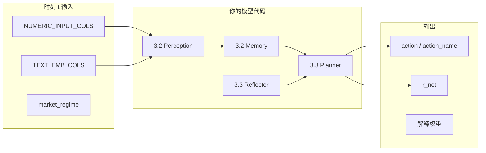

# 实验代码对接指南（IMTSA-Agent × 当前数据集）

本文档供你修改训练 / 回测 / 消融代码时使用。项目根目录为本仓库根路径；代码常量见 `src/imtsa/data/experiment_config.py`。

---

## 1. 你应该用哪些文件（重要）

| 用途 | 文件 | 不要用 |
|------|------|--------|
| **主实验训练/验证/测试** | `data/processed/aligned_daily_multimodal.parquet` | 不要用含 77 标的的原始 `prices_clean` 直接训练 |
| **动作与奖励** | `data/processed/labels_trading.parquet` | 不要自己临时算 B/S/H（除非做对比实验） |
| **RQ4 泛化（OOS）** | `data/processed/holdout_aligned_daily.parquet` + `holdout_labels_trading.parquet` | Holdout 标的不得进入 train/val |
| **时间切分** | `data/metadata/splits.json` | 不要 `random_split` / shuffle |
| **宏观慢变量** | 已 merge 进 `aligned_*` | 无需再读 `macro_clean`（除非做消融） |
| **文本模态** | `text_emb_0`…`text_emb_31` + `text_summary` | 稀疏；见 §5 |

重建数据：`python scripts/build_datasets.py`

---

## 2. 实验标的范围

### 2.1 Main（主实验）— 32 个

- **30 只股票** + **SPY / QQQ**（基准与 regime）
- 列表见 `config/symbols.yaml` 或 `splits.json` → `main_tickers`

### 2.2 Holdout（外部效度）— 15 个

- 列表见 `config/symbols_holdout.yaml` → `holdout_tickers`
- **禁止**用于超参搜索、早停、模型选择

### 2.3 数据规模（当前）

| 数据集 | 行数 | 标的数 |
|--------|------|--------|
| `aligned_daily_multimodal` | 91,616 | 32 |
| train / val / test | 64,448 / 8,000 / 19,168 | 32 |
| `holdout_aligned_daily` | 41,753 | 15 |
| L=60 有效窗口（约） | ~89,664 | — |

---

## 3. 时间切分（防泄漏）

来自 `data/metadata/splits.json`：

| Split | 起始 | 结束（含） |
|-------|------|------------|
| **train** | 2015-01-02 | 2022-12-31 |
| **val** | 2023-01-01 | 2023-12-31 |
| **test** | 2024-01-01 | 2026-05-21 |

**规则（写进论文 4.2 节）：**

1. 特征在时刻 `t` 只能使用 `Date <= t` 且当日收盘前可得的信息。
2. `future_ret_*` 仅作**标签/辅助头**，不得作为输入特征。
3. 测试集**顺序**前向回测，禁止用 test 统计量做归一化/选模。
4. 面板列 `split` 已预标：`train` / `val` / `test`。

```python
# 推荐：直接按 split 列筛选
df = pd.read_parquet("data/processed/aligned_daily_multimodal.parquet")
train = df[df["split"] == "train"]
val   = df[df["split"] == "val"]
test  = df[df["split"] == "test"]
```

---

## 4. 表结构与模态映射（对接论文章节 3）

### 4.1 索引键

- 主键：`(Date, ticker)`
- 频率：**日频**（每个交易日一行）
- 排序建议：`sort_values(["ticker", "Date"])`

### 4.2 数值模态 \(X^{(p)}\) — Perception 输入

| 列名 | 说明 | 建议 |
|------|------|------|
| `Open, High, Low, Close, Volume` | 复权日线 OHLCV | 可只用衍生特征 |
| `ret_1d, ret_5d, ret_20d` | 历史收益 | **输入** |
| `log_ret_1d` | 对数收益 | 输入 |
| `momentum_20, momentum_60` | 动量 | 输入 |
| `volatility_20, volatility_60` | 波动率 | 输入 |
| `ma_gap_20, ma_gap_60` | 均线偏离 | 输入 |
| `volume_chg_20, hl_range, oc_gap` | 量价结构 | 输入 |
| `FEDFUNDS, CPIAUCSL, UNRATE, DGS10, DGS2, T10Y2Y, VIXCLS` | 宏观（日频 ffill） | 慢特征，输入 |
| `spy_ret_1d_bench, excess_ret_1d` | 相对 SPY | 输入或分析用 |
| `future_ret_1d, future_ret_5d, future_ret_20d` | 未来收益 | **仅标签** |

**推荐特征列（复制到实验配置）：**

```python
PRICE_FEATURES = [
    "ret_1d", "ret_5d", "ret_20d", "log_ret_1d",
    "momentum_20", "momentum_60",
    "volatility_20", "volatility_60",
    "ma_gap_20", "ma_gap_60",
    "volume_chg_20", "hl_range", "oc_gap",
]
MACRO_FEATURES = [
    "FEDFUNDS", "CPIAUCSL", "UNRATE",
    "DGS10", "DGS2", "T10Y2Y", "VIXCLS",
]
NUMERIC_INPUT_COLS = PRICE_FEATURES + MACRO_FEATURES  # 20 维
```

### 4.3 文本模态 \(X^{(n)}\) — Perception 输入

| 列名 | 说明 |
|------|------|
| `text_emb_0` … `text_emb_31` | SEC/公告摘要的 32 维哈希 embedding |
| `text_summary` | 原始事件文本（调试/可解释性展示） |
| `event_count` | 当日事件条数（0 为多数） |
| `has_10k, has_10q, has_8k` | 是否含对应表单 |
| `days_since_event` | 距上次事件天数 |

```python
TEXT_EMB_COLS = [f"text_emb_{i}" for i in range(32)]
TEXT_META_COLS = ["event_count", "has_10k", "has_10q", "has_8k", "days_since_event"]
```

**注意：** 事件行约占 **1.5%**，训练时建议 `event_count` 作为门控，或接受稀疏文本。

### 4.4 市场状态（RQ4）

| 列名 | 取值 | 来源 |
|------|------|------|
| `market_regime` | `bull` / `bear` / `sideways` | SPY 60 日滚动收益划分 |
| `spy_roll_ret` | 连续值 | 同上 |

测试时按 `market_regime` 分组汇报 Sharpe、MDD 等。

### 4.5 决策与奖励（Planner / Reflector）

在 `labels_trading.parquet`（与 aligned 行对齐）：

| 列名 | 类型 | 说明 |
|------|------|------|
| `action` | int | `0=Hold, 1=Buy, 2=Sell` |
| `action_name` | str | `Hold` / `Buy` / `Sell` |
| `position` | float | 简化持仓（0/1） |
| `delta_position` | float | 仓位变化 |
| `r_gross` | float | 持仓 × 当日 `ret_1d` |
| `r_net` | float | 扣成本后收益（主优化目标） |
| `turnover` | float | 换手 |

**标签规则（默认，与 `config/settings.yaml` 一致）：**

- 用 `future_ret_1d`（次日收益）生成方向性 `action`
- `buy_threshold = +0.5%`，`sell_threshold = -0.5%`
- 成本：`cost_rate = slippage_rate = 0.0005` 每笔换手

论文若用自定义策略标签，请单独说明，并重新跑 `12_build_labels_trading.py`。

---

## 5. 与 IMTSA-Agent 模块的代码映射



| 论文模块 | 数据字段 | 实验代码建议 |
|----------|----------|--------------|
| Perception \(f_p\) | `NUMERIC_INPUT_COLS` | `StandardScaler` **仅在 train 上 fit** |
| Perception \(f_n\) | `TEXT_EMB_COLS` | 可与数值拼接或门控融合 |
| Memory \(m_t\) | 上一时刻 `action`, `r_net` | 按 `ticker` 分组构造序列 |
| Planner \(\pi(a_t\|s_t)\) | 监督：`action`；强化：用 `r_net` 作 reward | 按 ticker 构造 episode |
| 辅助预测 \(\hat{y}_{t+\Delta}\) | `future_ret_1d/5d/20d` | \(\Delta \in \{1,5,20\}\) **日** |
| RQ4 泛化 | `market_regime` 或 holdout 15 只 | 分段 / 跨标的测试 |

---

## 6. 最小加载模板（复制即用）

### 6.1 主实验 DataLoader 骨架

```python
from pathlib import Path
import json
import numpy as np
import pandas as pd

ROOT = Path(__file__).resolve().parents[1]  # repo root

PRICE_FEATURES = [...]  # 见 §4.2
MACRO_FEATURES = [...]
NUMERIC_INPUT_COLS = PRICE_FEATURES + MACRO_FEATURES
TEXT_EMB_COLS = [f"text_emb_{i}" for i in range(32)]
LOOKBACK = 60  # 日，对应论文 L

def load_main_panel():
    aligned = pd.read_parquet(ROOT / "data/processed/aligned_daily_multimodal.parquet")
    labels = pd.read_parquet(ROOT / "data/processed/labels_trading.parquet")
    # 可选：只取标签列，避免重复宽表
    label_cols = ["Date", "ticker", "action", "action_name", "position", "r_gross", "r_net", "turnover"]
    df = aligned.merge(labels[label_cols], on=["Date", "ticker"], how="left")
    return df.sort_values(["ticker", "Date"])

def iter_sequences(df: pd.DataFrame, split: str, lookback: int = LOOKBACK):
    """按 ticker 生成 [L, D] 窗口，避免跨股票泄漏。"""
    sub = df[df["split"] == split]
    for ticker, g in sub.groupby("ticker"):
        g = g.reset_index(drop=True)
        for i in range(lookback, len(g) - 1):  # 留 1 日给标签对齐
            window = g.iloc[i - lookback : i]
            row = g.iloc[i]
            x_num = window[NUMERIC_INPUT_COLS].values.astype(np.float32)
            x_txt = row[TEXT_EMB_COLS].values.astype(np.float32)
            y_action = int(row["action"])
            y_ret = float(row["future_ret_1d"])  # 或 row["r_net"] 用于 RL
            yield ticker, row["Date"], x_num, x_txt, y_action, y_ret
```

### 6.2 Holdout 评估

```python
def load_holdout_panel():
    return pd.read_parquet(ROOT / "data/processed/holdout_aligned_daily.parquet")

def load_splits():
    with open(ROOT / "data/metadata/splits.json", encoding="utf-8") as f:
        return json.load(f)
```

### 6.3 RQ4：按市场状态评估

```python
def evaluate_by_regime(df, score_fn):
    """score_fn: DataFrame -> dict metrics"""
    results = {}
    for regime in ["bull", "bear", "sideways"]:
        sub = df[df["market_regime"] == regime]
        results[regime] = score_fn(sub)
    return results
```

---

## 7. 消融实验（RQ2 / RQ3）数据开关

| 实验 | 代码改法 |
|------|----------|
| w/o Memory | 序列模型不传入 `action_{t-1}, r_{t-1}` |
| w/o Reflector | 去掉每 K 步的复盘逻辑（K 建议 10–20 **交易日**） |
| w/o Text | `TEXT_EMB_COLS` 置零或去掉 |
| w/o Macro | 去掉 `MACRO_FEATURES` |
| w/o Explain | 去掉 \(\mathcal{L}_{exp}\)，仍记录 attention 权重 |
| 仅数值 | `NUMERIC_INPUT_COLS` only |

---

## 8. 评价指标与论文表 1 对齐

| 论文指标 | 数据字段 / 计算 |
|----------|-----------------|
| 累计收益 | \(\prod (1 + r^{net}_t) - 1\) |
| Sharpe | `r_net` 日频年化 |
| MDD | 基于累计净值曲线 |
| 胜率 | \(\mathbb{1}[r^{net}_t > 0]\) |
| 换手率 | `turnover` 均值 |
| 方向准确率 | `action` vs `label_up_1d` 或 `future_ret_1d>0` |
| Faithfulness | 遮蔽 `text_emb_*` / 时间窗后的 \(\Delta p(a)\) |

**主结论请以 `r_net`（成本后）为准。**

---

## 9. 常见错误（务必避免）

1. **用 `future_ret_*` 当输入** → 前视偏差，审稿必拒。
2. **在全表 fit 标准化** → 用 test 信息泄漏；只在 `train` fit。
3. **shuffle 股票-日样本** → 破坏时序；按时间或 ticker 序列训练。
4. **把 holdout 15 只混入 train** → RQ4 无效；用 `holdout_*` 文件。
5. **把 SPY/QQQ 当普通股票训练 B/S/H** → 可单独处理或仅作 benchmark。
6. **期望分钟频** → 当前为**日频**；窗口 `L=60` 表示 60 **交易日**。
7. **修改标的后忘记重建** → 改 `config/symbols.yaml` 后执行 `python scripts/build_datasets.py`。

---

## 10. 实验配置建议（写入你的代码常量）

```python
# experiment_config.py
PROJECT_ROOT = Path(__file__).resolve().parents[1]
LOOKBACK_DAYS = 60          # 主实验 L
REFLECT_EVERY_K = 15        # Reflector 窗口（日）
AUX_HORIZONS = [1, 5, 20]   # 辅助预测头（日）
NUM_ACTIONS = 3               # Hold/Buy/Sell
MAIN_TICKERS = 32           # 见 splits.json
HOLDOUT_TICKERS = 15
TRAIN_END = "2022-12-31"
VAL_END = "2023-12-31"
```

---

## 11. 文件变更检查清单

修改实验代码前，勾选：

- [ ] 读取 `aligned_daily_multimodal.parquet`（主）或 `holdout_*`（OOS）
- [ ] 使用 `split` 列划分 train/val/test
- [ ] 输入列 = `NUMERIC_INPUT_COLS` + `TEXT_EMB_COLS`
- [ ] 标签 = `action` 或 reward = `r_net`
- [ ] 窗口按 `ticker` 分组，长度 = 60 日
- [ ] 不用 `future_ret_*` 作特征
- [ ] RQ4 使用 `market_regime` 或 holdout 文件
- [ ] 论文中写明：日频、32 主标的、15 holdout、时间切分日期

---

## 12. 相关路径速查

```
config/symbols.yaml              # Main 30+2 ETF
config/symbols_holdout.yaml        # Holdout 15
config/settings.yaml             # 阈值、路径、lookback
data/processed/aligned_daily_multimodal.parquet
data/processed/labels_trading.parquet
data/processed/holdout_aligned_daily.parquet
data/processed/holdout_labels_trading.parquet
data/metadata/splits.json
data/metadata/data_audit_report.md
scripts/build_datasets.py
docs/EXPERIMENT_DATA_GUIDE.md      # 本文档
```

如有新特征或新闻文本，在 `utils/features.py` / `utils/text_events.py` 扩展后重新 `build_datasets.py`，并同步更新本文档 §4。
